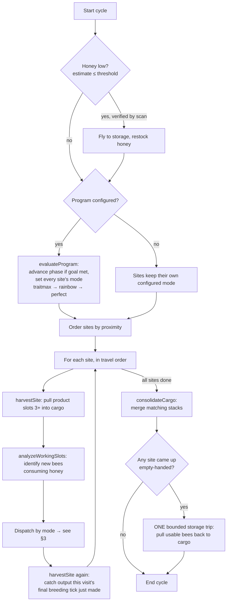
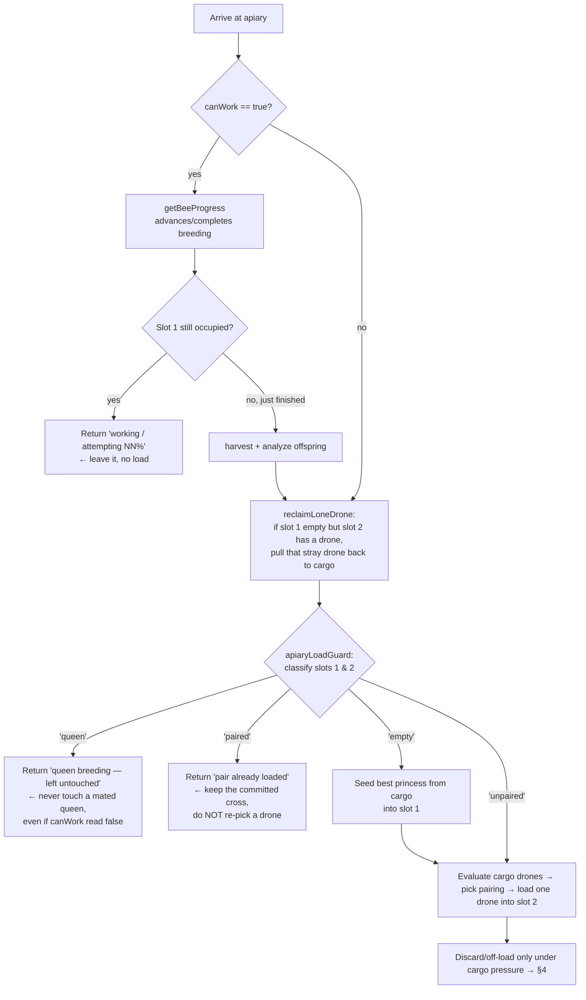

# Robot Decision & Pathing Flow

> **⚠️ MAINTENANCE REQUIREMENT — read before changing breeding/pathing logic.**
>
> This document is the human-readable map of *what the robot does, when, and why*.
> It is a required, living artifact — **not** optional scratch notes.
>
> **Any change to pathing or breeding decisions MUST update this file in the same
> commit.** That specifically means edits to: the main cycle (`M.runCycle`), any
> site runner (`runQualitySite`, `runMutationSite`, `runPerfectSite`,
> `executeJobAtApiary`), the apiary-load guard (`M.apiaryLoadGuard` /
> `classifyApiaryLoad`), lone-drone reclaim, storage/census logistics
> (`offloadSurplus`, `fetchJobParents`, `scanStorageCensus`), the genebank
> scheduler, or the culling policy. If you change the behavior, change the diagram
> and prose here to match, then re-run the test suite.
>
> Kept for **both** of us: it lets a fresh session (or a human) reason about the
> robot without re-deriving control flow from ~3k lines of Lua, and it's the
> reference we check pathing/breeding complaints against.
>
> Last verified against code: **v0.6.14** (2026-07-27).

---

## 1. Vocabulary

| Term | Meaning |
|---|---|
| **Apiary slot 1** | Queen/princess slot. Holds an unmated **princess** (needs a drone) or a mated **queen** (already breeding, will be consumed). |
| **Apiary slot 2** | Drone slot. |
| **Apiary slots 3+** | Product/output: combs, offspring drones, and the replacement princess. |
| **Cargo** | The robot's own inventory = the live candidate-bee pool (`config.workingSlots`). |
| **Storage** | Off-robot chests (the genebank). Round-trips cost travel, so they're minimized. |
| **Pure / hybrid** | A pure bee is homozygous for its species; a hybrid/carrier has two different species alleles. |
| **Pristine vs ignoble** | `isNatural=true` princess is renewable (pristine); `isNatural=false` is bred/degrading (ignoble). |

---

## 2. Top-level cycle (`M.runCycle`)

One cycle = one full pass over every apiary. Ordering is nearest-neighbor from the
robot's current position (direct flight, minimize travel), **not** fixed list order.

**Why this shape:**
- Honey first, so a low stock never strands a visit mid-analysis.
- One pass per site (harvest → analyze → decide → harvest), *not* two sweeps — a
  two-sweep design left half-set-up apiaries behind while harvesting everything
  else first, which looked like the robot "abandoning" a site.
- Storage read-back is **once per cycle and bounded**, only if some site starved —
  storage is otherwise a place we push surplus to, not poll every cycle.

---

## 3. Per-apiary decision (all four site runners)

Every runner shares the same front-end before it ever loads a pair. This is the
part that governs "does a drone go in, and next to what?"

### The apiary-load guard (why it exists)

`classifyApiaryLoad(slot1, slot2)` reads the **raw item names** (a mated queen is a
distinct `beeQueenGE` item; an unmated princess is `beePrincessGE`) — *not* the
analyzed genome, because a freshly mated queen is often still unanalyzed:

| Slot 1 | Slot 2 | State | Action |
|---|---|---|---|
| empty | — | `empty` | seed a princess |
| princess | empty | `unpaired` | **load a drone** (the one load case) |
| princess | drone | `paired` | leave — cross already committed |
| queen (or unknown occupant) | any | `queen` | leave — breeding, hands off |

**The bug this closed (v0.6.14):** previously the *only* thing stopping a
swapQueen/swapDrone onto an occupied slot 1 was `canWork()==true AND slot 1
occupied`. Whenever `canWork()` read **false** while slot 1 still held a bee
(output full, wrong climate/time, or a transient false), all four runners fell
straight through and loaded a pair anyway. That:
1. dropped a stray drone next to a mated **queen** (can't fertilize her — the drone
   just gets stranded in slot 2, the "random drones in the breeding slot"), and
2. re-picked a *different* drone next to an already-paired **princess** every visit
   ("random re-breeding").

The guard makes occupancy an explicit, name-based check instead of a `canWork`
side-effect. Verified by `bee_keeper_apiary_load_test.lua`.

---

## 4. Breeding-decision logic per mode

`runCycle` dispatches on `site.mode`. A global **program** (if configured) drives
every site through phases `traitmax → rainbow → perfect`; otherwise each site uses
its own configured mode.

| Mode / label | Handler | Goal | How it picks the pair |
|---|---|---|---|
| **traitmax/acquire** (Phase A) | `runMutationSite` → genebank scheduler | Bank the donor species whose *templates* carry the good alleles | Scheduler jobs (below) climb the mutation tree |
| **traitmax/combine** (Phase B) | `runQualitySite` | Concentrate good alleles into one max bee (species-agnostic) | Princess = best on-hand; drone = carries the working trait's good allele (`goodW` dominates), preferring an X-carrier once one exists |
| **species** | `runQualitySite` | Purify toward pure target species + max traits at once | Species tracked as one more trait; picks toward homozygous-pure |
| **perfect** | `runPerfectSite` | A species-pure bee that *also* carries the maxed allele set | Serial imprint, one trait at a time: introduce the allele via an X-carrier × donor, then homozygize within the species |
| **mutation** | `runMutationSite` | Obtain a species you don't yet hold | Look up recipe, load best satisfiable parent pair, re-attempt (probabilistic); on success hand off to `species` mode |
| **rainbow** | `runMutationSite` → scheduler | Build every reachable species' pure bank | Same scheduler as acquire, cycling the target through all species |

### Genebank scheduler jobs (acquire / rainbow)

The scheduler builds each species' purebred bank bottom-up and only spends a bank
once it's stocked. Job types: `mutate`, `grow`, `convert`, `fix`, `seedDrone`,
`seedPrincess`, `done`, `blocked`. `executeJobAtApiary` picks parents **greedily and
fertility-aware** — the princess closest to the pure target, then the drone that
best complements her, species weighted high so consolidation never trades species
purity for a stat.

**Key genetics reality (GTNH/Forestry):** mutations yield **hybrids**, not pure
offspring. A pure species is bootstrapped from two carriers (the `fix` job) at
roughly a 25% pure yield — so the scheduler churns `seedPrincess`/`seedDrone`/`fix`
until a pure pair appears. This is the dominant source of real storage round-trips.

### Special-condition gate (mutation)

Before a mutation step whose recipe needs a foundation block / biome / climate /
time the robot can't provide, it **beeps and waits** for the user to set it up, then
proceeds (`gateSpecialConditions`).

---

## 5. Logistics & anti-hoarding

- **Lone-drone reclaim** (`reclaimLoneDrone`): if slot 1 is empty but slot 2 holds a
  drone, pull it back to cargo before seeding a new princess — otherwise she'd mate
  the leftover drone (a wrong cross). Runs at the top of every site runner.
- **Cargo pressure off-load** (`offloadSurplus`): only when cargo is genuinely
  tight. Keeps the *current job's parent bees resident first* (protected keys), then
  by size, within the keep budget — so the scheduler isn't forced to re-fetch the
  same parents from storage next cycle.
- **Incremental storage census** (`censusApplyStack`): the bank census is a cache,
  updated in place on every deposit/fetch (±size, slot bookkeeping) so the robot
  does **not** re-sweep all chests each visit. Self-heals via a periodic full
  rescan (`censusRescanEvery`, default 12).
- **Cull redundant hybrids** (`cullBankedHybrids`, throttled by `cullEveryVisits`):
  trash a hybrid **only** once **both** species it carries already have a
  self-sustaining pure set (a pure princess **and** a pure drone). Of those, trash
  hybrid drones and *ignoble* princesses; keep *pristine* princesses. Never touches
  a hybrid carrying any species that still lacks a pure set (it may be that
  species' only carrier).

---

## 6. Where to look in code

| Concern | Symbol / file |
|---|---|
| Main cycle | `M.runCycle` — `bee_keeper_manager.lua` |
| Program phases | `M.evaluateProgram`, `bee_program.lua` |
| Quality / species breeding | `M.runQualitySite` |
| Mutation / rainbow | `M.runMutationSite`, `bee_mutation_graph.lua` |
| Perfect (combine) | `M.runPerfectSite`, `bee_combine.lua` |
| Genebank scheduler | `runGenebankSchedule`, `executeJobAtApiary`, `bee_genebank_scheduler.lua` |
| Apiary-load guard | `M.classifyApiaryLoad`, `M.apiaryLoadGuard` |
| Lone-drone reclaim | `M.reclaimLoneDrone` |
| Storage census cache | `M.scanStorageCensus`, `M.censusApplyStack`, `M.offloadSurplus` |
| Culling | `M.cullBankedHybrids`, `M.speciesHasPureSet` |
